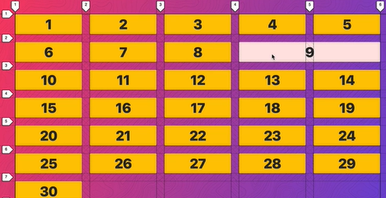
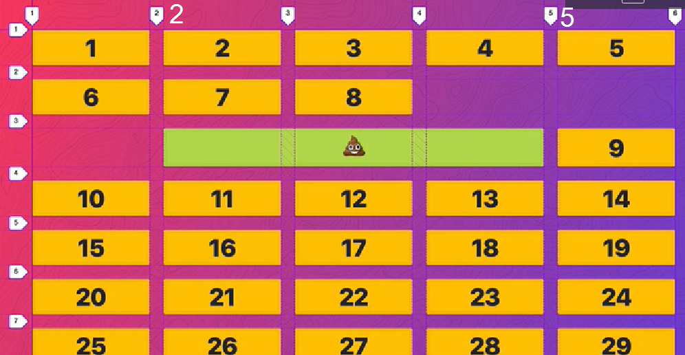

# css-grid

## index

<!-- @import "[TOC]" {cmd="toc" depthFrom=1 depthTo=6 orderedList=false} -->

<!-- code_chunk_output -->

* [css-grid](#css-grid)
	* [index](#index)
	* [basic setup](#basic-setup)
	* [explicit vs. implicit tracks](#explicit-vs-implicit-tracks)
	* [grid-auto-flow](#grid-auto-flow)
	* [sizing tracks with fr, auto and %](#sizing-tracks-with-fr-auto-and)
	* [repeat function](#repeat-function)
	* [sizing grid items](#sizing-grid-items)
	* [spanning](#spanning)

<!-- /code_chunk_output -->

## basic setup

```html
<div class="container">
    <div class="item">1</div>
    <div class="item">2</div>
    <div class="item">3</div>
    <div class="item">4</div>
    <div class="item">5</div>
    <div class="item">6</div>
    <div class="item">7</div>
    <div class="item">8</div>
    <div class="item">9</div>
    <div class="item">10</div>
</div>

<style>
    .container {
        display: grid;
    }
</style>
```

## explicit vs. implicit tracks
**explicit tracks**
* rows or columns which we defined via css
* the lines of explicit tracks are **dashed** in the firefox devtools *(1 in image)*
* the lines of explicit tracks are **solid**, where the grid does end. *(2 in image)*
* explicit tracks are defined like this (two columns, three rows):

```css
grid-template-columns: 80px 160px;
grid-template-rows: 50px 80px 80px;
```
**implicit tracks**
* rows or columns which we **did not** defined via css
* the lines of explicit tracks are **dotted** in the firefox devtools *(3 in image)*
* implicit tracks are defined like this (every implicit rows will be 60px):

```css
grid-auto-rows: 60px;
```


## grid-auto-flow
* By default adding more items than defined via `grid-template-rows` will create new (implicit) **rows**
* With the rule `grid-auto-flow: column;` we allow the grid to create new **columns** instead of new rows

## sizing tracks with fr, auto and %
* We should use **fr** (fractional unit) instead of **%** if we want to add up elements to the whole grid.
**Examples:**
```css
    /* Every item takes up the same space */ 
    grid-template-columns: 1fr 1fr 1fr 1fr;
    grid-template-columns: 25fr 25fr 25fr 25fr;
    /* The first item is 20% the 80% rest is shared by two other items */
    grid-template-columns: 20% 1fr 1fr;
    /* The first item takes however wide the widest 
    item in the track is, the other share the rest in a ratio 2:1 */
    grid-template-columns: auto 2fr 1fr;
}
```

* By default the height of the element is however high the element is but the width of the element is however wide the viewport ist (standard behaviour of block elements)

```css
.container {
    /* we could set an explicit height to the container to work around this */ 
    height: 500px;
    grid-template-rows: 1fr 4fr 2fr;
}
```

## repeat function
We can use the **repeat**-function instead of typing out the same properties over and  over:

```css
    /* intead of */ 
    grid-template-rows: 1fr 1fr 1fr 1fr;
    /* we could use */ 
    grid-template-rows: repeat(4, 1fr);

    /* or we can repeat a sequence like this */ 
    grid-template-rows: 1fr 2fr 1fr 2fr 1fr 2fr 1fr;
    /* by using repeate like this */
    grid-template-rows: repeat(4, 1fr 2fr);

    /* repeat can also be mixed with non-repeat items */
    grid-template-rows: 100px repeat(4, 1fr 2fr) auto;
}
```

## sizing grid items
* a column is as wide as the widest element in the column (see image blow)
* if we want to span an element over multiple columns (or rows) we need to tell the item to do so


## spanning
```css
.item9 {
    grid-column: span 2;
    /* similar option to rows
    grid-row: span 2;
    */
}
```

 ## start and stop for items
 * instead of teling the item to span, we can also implicitly define it's start and end track
```css
.poop {
    grid-column-start: 2;
    grid-column-end: 5;
    /* or the shorthand 
    grid-column: 2 / 5;
    */
}
```

* we could also span 2 but end at 5
```css
    grid-column: span 2 / 5;
```
* start at 2 but end at last track (-1 means last track)
```css
    grid-column: 2 / -1;
```
* start at 2 but end at the second last track
```css
    grid-column: 2 / -2;
```
